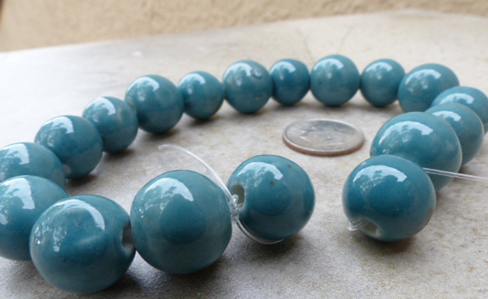

# Stringing beads - identifying research workflows from tool usage data (clustering)
- using data from our recent [global survey on Innovations in Scholarly Communication] (http://101innovations.wordpress.com)
- this is a subbranch from master repo [101innovations-survey-data] (https://github.com/bmkramer/101innovations-survey-data)

## About

The results of our 2015-2016 survey on research tool usage can provide insights into current practices across various fields, research roles, countries and career stages, and can be useful for researchers interested in changing research workflows. 

Based on co-occurrences of tools/platforms, we aim to identify typical research workflows. Previously, we identified tool combinations (from the 119 preset tools/platforms in our survey) that are used together more or less often than expected by chance (for details see our blogpost [Tools that love to be together](https://101innovations.wordpress.com/2016/11/06/tools-that-love-to-be-together/)).

To extend this analysis from separate tool combinations into groups of tools typifying full research workflows, one of the possibilities is looking at clusters.

## Clusters: tools occurring in similar workflows
Based on our co-occurrence data, we can look at which tools occur in similar workflows, i.e. have the most tools in common that they are or are not specifically used with. 

The source data ([survey_presets_frequencies_2-tailed_p-values_coded.csv] (survey_presets_frequencies_2-tailed_p-values_coded.csv)) is a matrix of assigned values (1, 0, -1 or NA) for all tool combinations, indicating significant (1, -1) or non-significant (0) p-values for the 2-tailed cumulative hypergeometric test used to determine whether tool combinations occur more (1) or less (-1) often together than expected by chance. 

When run with our hypergeometric test data, the clustering analysis script ([survey_heatmap_plot_RG_white_notrace.R] (survey_heatmap_plot_RG_white_notrace.R)) assigns each tool combination a color (1=green, -1=red, 0=white, NA=grey) and sorts them by placing tools that have a similar pattern of correlation with other tools closer together. The tree structure on both sides of the diagram indicates the hierarchy of tools that are most similar in this respect.

![cluster results preset tools 101 innovations survey] (survey_heatmap_p-values_2-tailed_coded_RG_white.png)

For more information and interpretation of the results, see our blogpost [Stringing beads: from tool combinations to workflows] [add link when published]

The script was provided by [Bastian Greshake] (https://github.com/gedankenstuecke); color and grid line representations were further adapted. 

## Further Information

- The project [Innovations in Scholarly Communication] (https://101innovations.wordpress.com/about-1/)
- The survey dataset on [Kaggle] (https://www.kaggle.com/bmkramer/101-innovations-research-tools-survey) where scripts can be written, executed and shared

