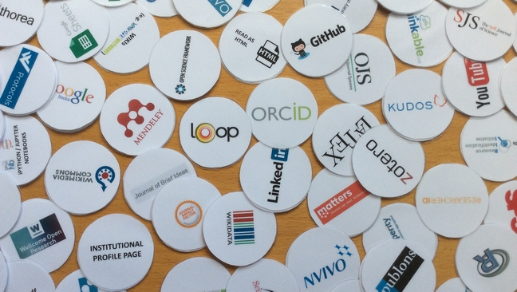

# Real-life Open Science workflows: use and interoperability of research tools 
- [Mozfest2016](https://mozillafestival.org/) session using data from our recent [global survey on Innovations in Scholarly Communication] (http://101innovations.wordpress.com) 

## What will we be doing?
We will look at how Open Science practices can be combined into a full Open Science workflow. We also want to come up with concrete ideas to improve the use and interoperability of Open Science tools.

## Tell me more!
There are currently many Open Science tools and platforms available, and we want to explore to which degree researchers can and do employ these in a full Open Science workflow. During MozFest, we would like to do this together using the results of our survey, which not only asked about support for Open Science but also about active use of platforms, tools and websites for 17 research activities. This results in a body of information on the research practices of 20,663 respondents across disciplines, research roles, career stages and countries. This session can include statistical analysis of survey results as well as technical appraisal of Open Science tools and platforms.

## How can I get involved?
* Come to our [session](https://app.mozillafestival.org/#_session-338)! It's on Saturday afternoon (3:15-5:15 pm) at floor 9, room 903. 
* In our [Contributing guidelines](CONTRIBUTING.md) you can read more about the goals and activities during the session. 
* Check out the [Mozilla Community Participation Guidelines](https://www.mozilla.org/en-US/about/governance/policies/participation/) code which applies to all facilitators and participants of this session.

## Want to know more?
To read more about the background and goals of this project, and about a related workshop we did on Open Science workflows, you can read the following blog posts:
- [How researchers are getting to grip with the myriad of new tools](http://blogs.lse.ac.uk/impactofsocialsciences/2015/11/11/101-innovations-in-scholarly-communication/) (guest post on LSE blog)
- [Full speed ahead with Open Science](https://im2punt0.wordpress.com/2016/10/22/full-speed-ahead-with-open-science/) (post on our library blog)

## Useful links during the session
- The [session notes](https://public.etherpad-mozilla.org/p/mozfest-2016-real-life-open-science-workflows--use) - etherpad for use during the Mozfest session
- The project [Innovations in Scholarly Communication] (https://101innovations.wordpress.com/about-1/)
- The [survey dataset on Kaggle] (https://www.kaggle.com/bmkramer/101-innovations-research-tools-survey) where data can be downloaded and scripts can be written, executed and shared
- The [400+ tools database](http://bit.ly/innoscholcomm-list) with information on currently over 600 online scholarly communication tools across the research cycle 

